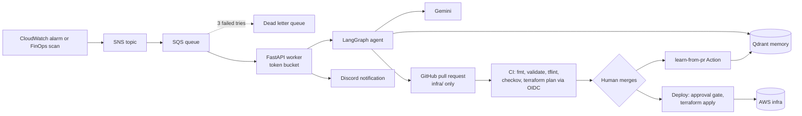

## Architecture

```mermaid
flowchart LR
  CW[CloudWatch alarm or FinOps scan] --> SNS[SNS topic]
  SNS --> SQS[SQS queue]
  SQS -. "3 failed tries" .-> DLQ[Dead letter queue]
  SQS --> W["FastAPI worker<br/>token bucket"]
  W --> A[LangGraph agent]
  A --> Q[("Qdrant memory")]
  A --> G[Gemini]
  A --> PR["GitHub pull request<br/>infra/ only"]
  W --> DC[Discord notification]
  PR --> CI["CI: fmt, validate, tflint,<br/>checkov, terraform plan via OIDC"]
  CI --> H{"Human merges"}
  H --> D["Deploy: approval gate,<br/>terraform apply"]
  D --> AWS[("AWS infra")]
  H --> L[learn-from-pr Action]
  L --> Q
```
